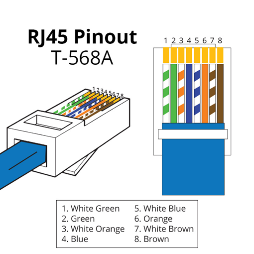
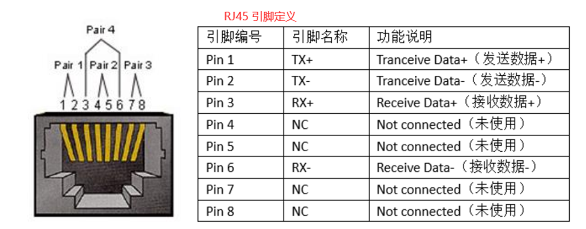

# WiFi与以太网

### 通信原理

OSI 七层模型是一个比较完美的模型。现实中我们主要使用 TCP/IP 模型，它将 OSI 的上三层和下两层分别进行了合并：

| TCP/IP 层级 | 对应 OSI 层      | 核心协议        |
| ----------- | ---------------- | --------------- |
| 应用层      | 应用/表示/会话层 | HTTP, DNS, MQTT |
| 传输层      | 传输层           | TCP, UDP        |
| 网络层      | 网络层           | IP, ICMP        |
| 链路层      | 链路/物理层      | 以太网, Wi-Fi   |

#### 以太网的诞生与演进

1970年代 Xerox PARC （施乐公司）发明以太网，最初使用同轴电缆，2.94Mbps
网络结构：星型拓扑或者线性总线
速率演进：10Mbps → 100Mbps → 1Gbps → 10Gbps（持续提升）

> 以太网至今仍是最稳定、最高速、最可靠的局域网技术

##### 以太网物理层：双绞线与RJ45
双绞线：8根导线两两绞合，差分信号消除电磁干扰（EMI）
RJ45接头（水晶头）：按T568B标准排列8个引脚
Cat5e → 1Gbps/100m，Cat6 → 10Gbps/55m，Cat6A → 10Gbps/100m





###### 以太网工作原理：CSMA/CD
载波监听（CS）：发送数据前先“监听”信道，有人在发就等待
多路访问（MA）：多台设备共享同一条通信线路（总线结构）
冲突检测（CD）：两台设备同时发送→检测到冲突→随机退避一段时间后重发

#### 交换机 (Switch)

工作在链路层，基于MAC地址在局域网内转发数据帧
让局域网内设备互相'认识'，减少冲突，提高效率

#### 路由器 (Router)

工作在网络层，基于IP地址进行路由选择，连接不同网络
局域网的'出入口'（默认网关），实现内外网通信

#### WiFi 

全称 Wireless Fidelity，基于 IEEE 802.11 系列标准
本质：利用电磁波（2.4GHz 或 5GHz）在设备间进行双向数据传输
工作方式：无线路由器发出电磁波 → 设备无线网卡接收并转化为数据

> 1997年首个802.11标准（2Mbps），到今天WiFi 7（46Gbps），持续进化近30年 

#### 载波

幅度调制(AM)：改变波的'高矮' → AM广播收音机（易受噪声影响）
频率调制(FM)：改变波的'疏密' → FM广播收音机（更稳定）
相位调制(PM/PSK)：改变波的起始角度 → WiFi主要采用此技术

> QAM（正交幅度调制）= 同时改变幅度+相位，WiFi 6用1024-QAM，每符号携带10比特

#### OFDM
OFDM（正交频分复用）：将宽频段分割成多个相互正交的子载波
每个子载波独立传输数据，等于'多条车道'并行运货，成倍提升效率
正交性：子载波频率间隔精确设计，互不干扰，可紧密排列节省频谱
抗多径衰落：信号反射产生多条路径，OFDM通过'循环前缀'应对

> OFDM从WiFi 2 (802.11a)起引入，WiFi 6升级为OFDMA支持多用户同时共享子载波 

#### IP地址

IPv4：4段0~255的数字，每段8位，共32位（如 192.168.1.100）
私有地址：192.168.x.x / 10.x.x.x，仅局域网内有效
公有地址：互联网可见，多设备通过NAT共享一个公有IP
子网掩码 255.255.255.0：前3段相同的设备在同一子网

#### DHCP

DHCP：设备接入网络时自动获取IP、子网掩码、网关、DNS
客户端                                      DHCP服务器
    |       ----- DISCOVER ----->         | 寻找DHCP
    |       <-----    OFFER   -------        | 返回可用IP
    |       -----  REQUEST   ----->       | 请求使用此IP
    |       <-----       ACK       ------       | 分配成功

> 静态IP（手动）地址固定不变
> 服务器/打印机/Arduino

#### MQTT协议

发布/订阅模式：发布者和订阅者解耦，通过Broker中转消息
Topic（主题）：如 'lab/temperature'，订阅者选择关注哪个主题
为何适合IoT：最小消息仅2字节，支持断线重连，三种QoS质量保证
免费Broker：broker.hivemq.com（测试用）/ EMQX / 自建Mosquitto

> 对比HTTP：HTTP是请求-响应（你问我答），MQTT是推送（有消息就推），更适合IoT传感器

### 典型应用

【案例1】全屋智能家居通信架构 

为什么要混合使用三种通信技术？ 

WiFi：手机/电视/电脑——需要高带宽、接入互联网 
ZigBee：灯光/温控/传感器——低功耗，可接入65000+节点 
以太网：NAS存储/安防摄像头——需要稳定高速，不怕布线 

【案例2】展览级交互装置WiFi应用 

场景：美术馆互动装置，50+传感器，观众接近时实时响应灯光音效 

挑战：公共场所WiFi干扰严重 + 布线美观限制 + 延迟<100ms要求 
方案：独立AP（5GHz专用频段）+ UDP协议（低延迟）+ 本地边缘计算

【案例3】工业生产线——以太网的主场 

场景：汽车工厂生产线，实时性<1ms，绝对稳定，高清摄像监控 

为何不用WiFi：电机/变频器产生强电磁干扰（EMI），破坏2.4/5GHz信号 

数据量大：高清摄像头+机械臂反馈，需要Gbps级带宽 
工业以太网协议：EtherCAT（<1μs延迟）/ Profinet / Modbus TCP

### Arduino实践

简单的连接WiFi

```C
#include <WiFi.h>
const char* ssid = "wifi-name";
const char* pass = "wifi-password";

void setup() {
    Serial.begin(115200);
    // 输入名字和密码
    WiFi.begin(ssid, pass);
    
    int cnt = 0;
    while (WiFi.status() != WL_CONNECTED && cnt < 20) {
        delay(500);
        Serial.print(".");
        cnt++;
    }
    if (WiFi.status() == WL_CONNECTED) {
        Serial.println("\n连接成功！");
        // 查看IP和Mac地址
        Serial.println(WiFi.localIP());
        Serial.println(WiFi.macAddress());
    }
}

void loop() {
    if (WiFi.status() != WL_CONNECTED) {
        WiFi.reconnect();
    }
}
```

Web服务器控制小灯

```c
#include <WiFi.h>
#include <WebServer.h>

const char* ssid = "wifi-name";
const char* pass = "wifi-password";
const int LED_PIN = 2;

WebServer server(80);

void setup() {
    Serial.begin(115200);
    pinMode(LED_PIN, OUTPUT);
    digitalWrite(LED_PIN, LOW);
    WiFi.begin(ssid, pass);
    while (WiFi.status() != WL_CONNECTED) {
        delay(500);
        Serial.print(".");
    }
    
    // http://IP/
    server.on("/", []() {
        String html = "<h1>ESP32 Web Control</h1>";
        html += "<p><a href='/on'><button>ON</button></a></p>";
        html += "<p><a href='/off'><button>OFF</button></a></p>";
        server.send(200, "text/html; charset=utf-8", html);
    });

    // http://IP/on
    server.on("/on", []() {
        digitalWrite(LED_PIN, HIGH);
        server.send(200, "text/plain", "LED is ON");
        Serial.println("Command: LED ON");
    });

    // http://IP/off
    server.on("/off", []() {
        digitalWrite(LED_PIN, LOW);
        server.send(200, "text/plain", "LED is OFF");
        Serial.println("Command: LED OFF");
    });

    server.begin();
    Serial.println("HTTP Server Started");
}

void loop() {
    // constant
    server.handleClient();
    
    if (WiFi.status() != WL_CONNECTED) {
        WiFi.reconnect();
    }
}
```

MQTT多设备消息互发

```c
#include <WiFi.h>
#include <PubSubClient.h>

const char* ssid = "wifi-name";
const char* pass = "wifi-password";
const char* mqtt_server = "broker.hivemq.com"; 

WiFiClient espClient;
PubSubClient client(espClient);

void callback(char* topic, byte* payload, unsigned int len) {
    String msg = "";
    for (int i = 0; i < len; i++) {
        msg += (char)payload[i];
    }
    Serial.print(topic);
    Serial.println(msg);

    if (msg == "on") {
        digitalWrite(2, HIGH);
    } else if (msg == "off") {
        digitalWrite(2, LOW);
    }
}

void reconnect() {
    while (!client.connected()) {
        if (client.connect("ESP32_001")) {
            Serial.println("已连接");
            client.subscribe("lab/control");
        } else {
            delay(5000);
        }
    }
}

void setup() {
    Serial.begin(115200);
    pinMode(2, OUTPUT);

    WiFi.begin(ssid, pass);
    while (WiFi.status() != WL_CONNECTED) {
        delay(500);
        Serial.print(".");
    }
    Serial.println("\nWiFi 已连接");

    // 2. 配置 MQTT
    client.setServer(mqtt_server, 1883);
    client.setCallback(callback);
}

void loop() {
    if (!client.connected()) {
        reconnect();
    }
    client.loop();
    static unsigned long lastMsg = 0;
    if (millis() - lastMsg > 5000) {
        lastMsg = millis();
        client.publish("lab/temp", "25.6");
    }
}
```

