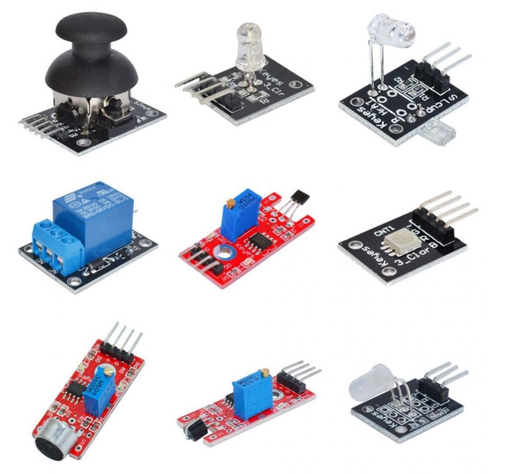
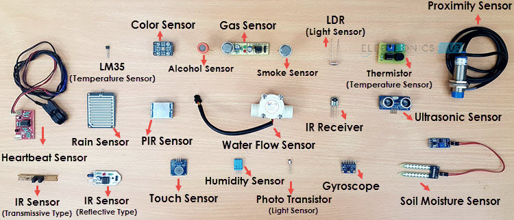

### 感知的原理
感觉+知觉
感觉是接收到外界的变化，重点在接受
知觉是了解到外界的变化，重点在判断（不是回应）

⼈的感知系统中存在哪些
感受器官—感觉—感知对象？

机器的感知：模拟⼈类的感知能⼒获取外部环境的信息
接收+判断如何通过机器来实现？
接收信息：让传感器的某个属性发生对应的变化


### 开发板辨认


### 传感器辨认



**第一排：**

双轴按键摇杆模块 (XY Joystick Module)：带有黑色的摇杆帽，类似于游戏手柄上的摇杆。它可以输出 X 轴和 Y 轴的模拟量（电位器原理），并且按下摇杆时可以触发 Z 轴的数字按键信号。

RGB 三色 LED 模块 (RGB LED Module)：黑色板子，带有一个透明的四脚 LED 灯珠（R, G, B, -）。通过控制三个颜色引脚的PWM信号，可以混合出各种颜色的光。

魔术光杯模块 (Magic Light Cup Module)：包含一个透明 LED 和一个水银开关。这是魔术光杯的“另一半”，通常这两个模块配合使用，通过倾斜状态的改变来模拟光在两个杯子之间倒来倒去的效果。

**第二排：** 

5V 继电器模块 (5V Relay Module)：蓝色的方形元件（继电器）和蓝色的接线端子。它相当于一个电子开关，可以用单片机的低压/弱电流信号来控制高压/大电流设备的通断。

线性霍尔传感器模块 (Linear Hall Effect Sensor)：红色板子，带有蓝色电位器，前端是一个黑色的三脚扁平元件。与普通的开关型霍尔不同，线性霍尔可以输出随磁场强度变化的模拟量信号。

SMD RGB 贴片 LED 模块 (SMD RGB LED Module)：功能与三色 LED 模块类似，但这个使用的是表面贴装（SMD）的小型方形灯珠，通常亮度更高且光线更均匀。

**第三排：** 

声音/麦克风传感器模块 (Sound / Microphone Sensor Module)：红色板子，最前端有一个银色圆柱形带黑色网格的元件（驻极体麦克风）。它可以检测环境声音的大小，蓝色的电位器用于调节声音触发的灵敏度阈值。

槽型光耦 / 光折断器模块 (Photo Interrupter / Light Blocking Sensor)：红色板子前端有一个黑色带凹槽的 U 型元件。两侧分别是红外发射管和接收管，当有物体经过凹槽遮挡住光线时，模块就会输出一个触发信号，常用于测速或限位检测。

双色 LED 模块 (Bi-color LED Module)：黑色板子，带有一个三脚的磨砂/雾面 LED 灯珠。它内部封装了两种颜色的发光芯片（通常是红和绿），通过控制不同的引脚可以使其发红光、绿光或混合的颜色。


**第一排：**

魔术光杯模块 (Magic Light Cup Module)：板子上同时带有一个玻璃水银开关和一个透明的 LED 灯。通常成对使用，倾斜时水银开关触发，控制 LED 的亮暗。

霍尔磁力传感器 (Hall Effect Sensor)：顶端有一个黑色的三脚晶体管状元件（A3144霍尔元件），用于检测磁场的存在和强度。

红外避障传感器 (Infrared Obstacle Avoidance Sensor)：红色PCB板，前端有一个黑色接收管和一个透明/浅蓝色红外发射管，板子上的蓝色方形元件是电位器，用来调节检测距离。

**第二排：** 

双色或 RGB LED 模块 (Bi-color / RGB LED Module)：一个大尺寸的透明 LED 灯珠直接焊接在带有三个引脚的电路板上，可以通过控制引脚输出不同颜色的光。

水银倾斜开关模块 (Mercury Tilt Switch Module)：倾斜的玻璃管内可以清晰看到一滴银白色的水银。当模块倾斜导致水银滚动接触到两端引脚时，电路导通。

温度传感器模块 (DS18B20 / LM35 Temperature Sensor)：带有一个TO-92 封装（半圆柱形）的黑色三脚芯片，通常是 DS18B20 数字温度传感器或 LM35 线性温度传感器。

**第三排：**

激光发射模块 (Laser Emitter Module)：最显眼的是那个黄铜色的圆柱形激光头，通电后可以发射红色的激光束。

震动/倾斜开关模块 (Vibration / Tilt Switch Module)：包含一个蓝色的方形塑料元件，内部有滚珠或弹簧结构，当发生震动或达到特定倾斜角度时会触发信号。

热敏电阻传感器 (Thermistor Module)：伸出来的一颗非常微小的玻璃封装元件是热敏电阻（通常是 NTC），其电阻值会随环境温度的变化而改变，常用于测量环境温度。



1. Heartbeat Sensor (心率传感器)：带有一个黑色的指夹（或耳夹）以及一块小型的信号处理板，用于检测脉搏。
2. IR Sensor (Transmissive Type) (透射式红外传感器 / 槽型光耦)：其实就是“光折断器”，U型槽两侧分别是红外发射和接收端。

3. LM35 (Temperature Sensor) (LM35 温度传感器)：长得像个三脚小晶体管（TO-92封装），用于输出与摄氏温度成线性关系的模拟电压。
4. Color Sensor (颜色传感器)：通常是 TCS3200 模块，板子上有几颗白色的 LED 用来补光，中间是感光阵列，用于识别物体的颜色。 
5. Alcohol Sensor (酒精传感器)：MQ系列气体传感器的一种，探头内部有加热丝和气敏材料。
6. Gas Sensor (气体传感器)：同为MQ系列，根据型号不同（如MQ-2、MQ-3等）可以检测可燃气体、甲烷等。 
7. Smoke Sensor (烟雾传感器)：也是MQ系列传感器，专门用于检测空气中的烟雾浓度。
8. Rain Sensor (雨滴传感器)：有一块表面布满梳状走线的检测板，当雨水滴在上面时，导电性会发生变化。
9. PIR Sensor (人体红外传感器)：被动式红外传感器，用来检测人或动物移动发出的红外线（图中这款似乎没带常见的白色半球形菲涅尔透镜）。
10. Water Flow Sensor (水流量传感器)：白色的塑料管件，内部有一个带有磁铁的水轮子和霍尔元件，水流过时转动产生脉冲信号。
11. IR Sensor (Reflective Type) (反射式红外传感器)：带有红外发射管和接收管，通常用于智能小车的黑白线循迹或近距离避障。 
12. Touch Sensor (触摸传感器)：通常是电容式触摸模块，用手指触碰感应区就能输出开关信号。
13. Humidity Sensor (湿度传感器)：图中是一颗蓝色的 DHT11 温湿度传感器，可以同时测量环境的温度和湿度。
14. Photo Transistor (Light Sensor) (光敏三极管 / 光传感器)：外观像个透明的小灯泡，对光线强度非常敏感。

15. LDR (Light Sensor) (光敏电阻)：带有两根细长引脚，电阻值会随着环境光线的变亮而迅速降低。
16. Thermistor (Temperature Sensor) (热敏电阻模块)：最前端通常是一颗微小的玻璃珠（NTC热敏电阻），用于温度测量。
17. Proximity Sensor (接近传感器 / 接近开关)：最右上方带有一根长长的粗电缆，这种工业圆柱形外观的通常是电感式或电容式接近开关，常用于检测金属物体或自动化测距。
18. IR Receiver (红外接收管)：黑色的三脚元件，专门用来接收红外遥控器发出的 38KHz 载波信号。
19. Ultrasonic Sensor (超声波传感器)：大名鼎鼎的 HC-SR04，带有两个像眼睛一样的超声波发射头和接收头，用于测距。
20. Gyroscope (陀螺仪模块)：一块很小的方形电路板，通常是 MPU6050，可以测量三轴加速度和三轴角速度（姿态传感器）。
21. Soil Moisture Sensor (土壤湿度传感器)：带有两个长长的叉子形探针，插在花盆泥土里，通过测量土壤的导电率来判断泥土的干湿程度。


### 传感器具体使用

#### 一、 环境感知传感器

##### 1. NTC 热敏电阻

- **名称**：NTC 热敏电阻  
- **用法**：与固定电阻组成分压电路，将温度变化转换为电压信号输出，经 Arduino 模拟引脚读取后，可利用 Steinhart-Hart 方程还原为温度值。  

```c
const int NTC_PIN = A0;
const float R_SERIES = 10000.0; // 10k固定电阻
const float R_NOMINAL = 10000.0; // 25 C NTC标称阻值
const float T_NOMINAL = 25.0; // 标称温度
const float B_COEFFICIENT = 3950.0;

void setup(){
  Serial.begin(9600);
  Serial.println("NTC热敏电阻温度计启动...");
}

void loop() {
  int adcVal = analogRead(NTC_PIN);
  // 后续代码可加入 Steinhart-Hart 方程换算温度
}
```

##### 2. LM35 精密温度传感器

- **名称**：LM35 精密温度传感器  
- **用法**：输出电压与摄氏温度严格线性对应，每升高1℃输出增加10mV，无需外部校准，直接连接模拟引脚即可使用。  

```C
const int LM35_PIN = A0;

void setup() {
  Serial.begin(9600);
  // analogReference(INTERNAL); // 提升精度时可取消注释
  Serial.println("LM35 温度计启动...");
}

void loop() {
  int adcVal = analogRead(LM35_PIN);
  float voltage = adcVal * (5.0 / 1023.0); // 转换为电压
}
```

##### 3. DHT11 / DHT22 温湿度传感器

- **名称**：DHT11 温湿度模块  
- **用法**：内置 8 位 MCU，使用专有单总线协议输出经过校准的数字数据，可同时测量温度与湿度，需配合 Adafruit DHT 库使用。  

```c
#include <DHT.h>

#define DHT_PIN 2
#define DHT_TYPE DHT11 // 若使用DHT22则改为DHT22

DHT dht(DHT_PIN, DHT_TYPE);

void setup() {
  Serial.begin(9600);
  dht.begin();
  Serial.println("DHT 温湿度传感器就绪");
}

void loop() {
  delay(2000); // 采样间隔不能低于2秒
  // 后续通过 dht.readTemperature() 和 dht.readHumidity() 读取
}
```

##### 4. DS18B20 单总线数字温度传感器

- **名称**：DS18B20 防水探头版  
- **用法**：支持 1-Wire 总线协议，多个传感器可共用同一根数据线，每个拥有唯一 64 位 ROM 地址，适合液体或潮湿环境。  

```C
#include <OneWire.h>
#include <DallasTemperature.h>

#define ONE_WIRE_BUS 2 // 数据引脚
OneWire oneWire(ONE_WIRE_BUS);
DallasTemperature sensors(&oneWire);

void setup() {
  Serial.begin(9600);
  sensors.begin();
  int count = sensors.getDeviceCount();
  Serial.print("检测到"); 
  Serial.print(count);
  Serial.println(" DS18B20 传感器");
}

void loop() {
  // 在此处加入传感器读取逻辑
}
```

##### 5. 光敏电阻 (LDR)

- **名称**：光敏电阻 (LDR)  
- **用法**：利用光电导效应工作，光照越强阻值越低，配合 10kΩ 分压电阻接入 Arduino 模拟引脚，常用于自动照明控制。  

```c
const int LDR_PIN = A0;
const int LED_PIN = 9;

void setup() {
  Serial.begin(9600);
  pinMode(LED_PIN, OUTPUT);
}

void loop() {
  int lightVal = analogRead(LDR_PIN);
  int brightness = map(lightVal, 50, 950, 255, 0); // 光越暗LED越亮
  brightness = constrain(brightness, 0, 255); // 限制范围
  // 可配合 analogWrite(LED_PIN, brightness); 使用
}
```

##### 6. BH1750 数字光照强度传感器

- **名称**：BH1750 光照模块  
- **用法**：16位数字环境光传感器，通过 I2C 接口直接以勒克斯 (lux) 为单位输出量化的光照强度，无需手动计算。  

```c
#include <Wire.h>
#include <BH1750.h>

BH1750 lightMeter;

void setup() {
  Serial.begin(9600);
  Wire.begin();
  if (lightMeter.begin(BH1750::CONTINUOUS_HIGH_RES_MODE)) {
    Serial.println("BH1750 初始化成功(高精度连续模式)");
  } else {
    Serial.println("BH1750 未找到,请检查接线!");
  }
}

void loop() {
  // 此处加入 lightMeter.readLightLevel() 等读取逻辑
}
```

##### 7. BMP280 气压/温度传感器

- **名称**：BMP280 气压模块  
- **用法**：高精度 MEMS 压阻式传感器，可同时测量气压和温度并推算海拔高度，使用 I2C 工作电压为 3.3V。  

```c
#include <Wire.h>
#include <Adafruit_BMP280.h>

Adafruit_BMP280 bmp;

void setup() {
  Serial.begin(9600);
  if (!bmp.begin(0x76)) { // SDO 接 GND 地址为 0x76
    Serial.println("BMP280 未找到!检查地址和接线");
    while (1) delay(10);
  }
  // 推荐天气监测配置
  bmp.setSampling(Adafruit_BMP280::MODE_NORMAL,
                  Adafruit_BMP280::SAMPLING_X2);
}

void loop() {
  // 获取数据的逻辑
}
```

---

#### 二、 运动与距离传感器

##### 8. HC-SR04 超声波测距传感器

- **名称**：HC-SR04 超声波模块 
- **用法**：Trig 引脚发送高电平触发后，发射超声波脉冲，测量 Echo 引脚高电平脉冲的时间（飞行时间）以计算距离。  

```c
const int TRIG_PIN = 9;
const int ECHO_PIN = 10;

void setup() {
  Serial.begin(9600);
  pinMode(TRIG_PIN, OUTPUT);
  pinMode(ECHO_PIN, INPUT);
  Serial.println("HC-SR04 超声波测距仪就绪...");
}

float measureDistance() {
  digitalWrite(TRIG_PIN, LOW);
  delayMicroseconds(2);
  // 后续需发送 10us 高电平并用 pulseIn 读取回波时间
  return 0.0;
}

void loop() {
  measureDistance();
}
```

##### 9. 红外避障传感器

- **名称**：红外避障传感器  
- **用法**：通过发射和接收红外光，遇障碍物时反射信号触发比较器输出数字低电平（LOW），适用于机器人近距离避障或循迹。  

```c
const int IR_PIN = 7;
const int LED_PIN = 13;

void setup() {
  Serial.begin(9600);
  pinMode(IR_PIN, INPUT);
  pinMode(LED_PIN, OUTPUT);
}

void loop() {
  bool obstacle = (digitalRead(IR_PIN) == LOW);
  if (obstacle) {
    Serial.println("检测到障碍物!");
  }
}
```

##### 10. HC-SR501 PIR 人体红外传感器

- **名称**：PIR 传感器 HC-SR501  
- **用法**：被动检测人体发出的远红外辐射变化，检测到运动时输出高电平（HIGH），模块上电需要大约 30 秒进行预热。  

```c
const int PIR_PIN = 8;
const int LED_PIN = 13;
const int BUZZER_PIN = 12;
bool prevState = false;

void setup() {
  Serial.begin(9600);
  pinMode(PIR_PIN, INPUT);
  pinMode(LED_PIN, OUTPUT);
  pinMode(BUZZER_PIN, OUTPUT);
  
  Serial.println("PIR预热中,请稍候30秒...");
  for (int i=30; i>0; i--) {
     // 预热等待逻辑
  }
}

void loop() {
  // 通过 digitalRead(PIR_PIN) 读取状态并触发报警
}
```

##### 11. MPU-6050 六轴 IMU 传感器

- **名称**：MPU-6050 IMU 模块
- **用法**：集成 3 轴陀螺仪和 3 轴加速度计，内置数字运动处理器（DMP）完成姿态解算，通过 I2C 接口通信。  

```c
#include <Wire.h>
#include <MPU6050.h>

MPU6050 mpu;

void setup() {
  Serial.begin(9600);
  Wire.begin();
  mpu.initialize();
  
  if (mpu.testConnection()) {
    Serial.println("MPU-6050 连接成功");
  } else {
    Serial.println("MPU-6050 未找到,检查接线!");
    while (1);
  }
}

void loop() {
  // 在此读取加速度与陀螺仪数据
}
```

##### 12. 旋转编码器

- **名称**：旋转编码器  
- **用法**：通过输出 A/B 相位差 90° 的正交脉冲来检测旋转方向和角度，最佳实践是配合 Arduino 的外部中断进行精确计数。  

```c
const int CLK_PIN = 2; // 外部中断0
const int DT_PIN = 3;
const int SW_PIN = 4;

volatile int encoderCount = 0;
volatile int lastCLK;

void setup() {
  // 初始化引脚及附加中断设置 (attachInterrupt)
}

// 中断服务函数
void encoderISR() {
  int clkNow = digitalRead(CLK_PIN);
  if (clkNow != lastCLK) {
    if (clkNow == HIGH) {
      if (digitalRead(DT_PIN) != clkNow) encoderCount++;
      else encoderCount--;
    }
  }
  lastCLK = clkNow;
}

void loop() {
  // 主循环可读取并打印 encoderCount
}
```

---

#### 三、 化学与特殊传感器

##### 13. MQ-2 可燃气体/烟雾传感器

- **名称**：MQ-2 气体传感器  
- **用法**：半导体接触气体时电阻显著下降，内部有加热丝维持工作温度。提供模拟电压浓度输出和数字阈值报警输出。  

```c
const int MQ2_AOUT = A0;
const int MQ2_DOUT = 7;
const int BUZZER_PIN = 12;
const int LED_RED = 13;
const int ALARM_THRESHOLD = 400; // ADC阈值

void setup() {
  Serial.begin(9600);
  pinMode(MQ2_DOUT, INPUT);
  pinMode(BUZZER_PIN, OUTPUT);
  pinMode(LED_RED, OUTPUT);
}

void loop() {
  // 读取 MQ2_AOUT 或 MQ2_DOUT 实现报警逻辑
}
```

##### 14. 土壤湿度传感器

- **名称**：土壤湿度传感器  
- **用法**：测量土壤探针间的导电性（含水量越高电阻越低），建议通过数字引脚控制传感器供电，仅在读取时通电以减缓电化腐蚀。  

```c
const int SOIL_PIN = A0;
const int PUMP_PIN = 12; // 继电器控制水泵
const int PWR_PIN = 6;   // 传感器供电引脚

const int DRY_THRESHOLD = 700;
const int WET_THRESHOLD = 350;

void setup() {
  Serial.begin(9600);
  pinMode(PUMP_PIN, OUTPUT);
  pinMode(PWR_PIN, OUTPUT);
  digitalWrite(PUMP_PIN, LOW);
  Serial.println("智能浇花系统启动...");
}

void loop() {
  // 控制 PWR_PIN 高电平进行读取，完成后拉低
}
```

##### 15. 声音传感器模块

- **名称**：声音传感器模块  
- **用法**：驻极体麦克风将声波振动转为电信号，AOUT 输出声波实时模拟电压，DOUT 在超阈值时切换数字电平。  

```c
const int SOUND_AOUT = A0;
const int SOUND_DOUT = 7;
const int LED_PIN = 9;
const int BASELINE = 512;
const int SAMPLE_NUM = 60;

void setup() {
  // 初始化代码
}

float readSoundRMS() {
  long sumSq = 0;
  for (int i = 0; i < SAMPLE_NUM; i++) {
    int v = analogRead(SOUND_AOUT) - BASELINE;
    sumSq += (long)v * v;
    delayMicroseconds(200);
  }
  // 返回计算后的均方根
  return 0.0; 
}

void loop() {
  readSoundRMS();
}
```

##### 16. A3144 霍尔传感器

- **名称**：霍尔传感器 A3144  
- **用法**：单极性霍尔开关，检测到南极(S极)强磁场时输出低电平。由于是开漏输出，必须使用外部 10kΩ 上拉电阻。  

```c
const int HALL_PIN = 2; // 外部中断0

volatile unsigned long lastMicros = 0;
volatile unsigned long pulsePeriod = 0;
volatile bool newData = false;

void setup() {
  // 需在此处使用 attachInterrupt 绑定 hallISR
}

// 中断服务函数
void hallISR() {
  unsigned long now = micros();
  if (lastMicros > 0) {
    pulsePeriod = now - lastMicros;
    newData = true;
  }
  lastMicros = now; // 记录本次触发时间
}

void loop() {
  // 通过 pulsePeriod 计算 RPM 转速
}
```


### 信号采样滤波方法

#### 限幅滤波法

设最大偏差 A
|新值 - 旧值| ≤ A → 接受
|新值 - 旧值| > A → 丢弃，用旧值

✓ 有效克服偶然脉冲干扰
✗ 无法抑制周期性干扰，平滑度差

#### 中位值滤波法

连续采样 N 次（N取奇数）按大小排序 取第 (N+1)/2 位值

✓ 克服波动干扰；温度/液位效果良好
✗ 不适于流量、速度等快速变化参数

#### 算术平均滤波法

ȳ = (x₁+x₂+…+xₙ) / N 
流量 N=12，压力 N=4

✓ 适合具有随机干扰的平稳信号
✗ 测速慢；比较浪费 RAM

#### 递推平均滤波法

固定长度队列（FIFO）
新数据入队尾，旧数据出队头
对队列内 N 个值取均值

流量 N=12，压力 N=4，液面 N=4~12，温度 N=1~4

✓ 对周期性干扰抑制强；平滑度高
✗ 灵敏度低；脉冲干扰抑制差；费RAM

#### 一阶滞后滤波法

Y[n] = (1-a)·X[n] + a·Y[n-1]
a ∈ (0, 1)   a越大平滑度越高，a越小灵敏度越高（响应快）

✓ 对周期性干扰抑制良好；适合高频波动
✗ 存在相位滞后；无法消除 > 采样频率½ 的干扰

#### 加权递推平均滤波法

Y = Σ(wᵢ·xᵢ) / ΣWᵢ
越近时刻 → 权重越大；权大则灵敏↑，平滑↓

✓ 适合纯滞后大、采样周期短的系统
✗ 对变化缓慢信号效果差；参数调试复杂

#### 消抖滤波法

新值=当前值 → 计数器清零
新值≠当前值 → 计数器+1
计数器≥N → 更新当前有效值

✓ 避免临界值附近控制器反复开/关抖动
✗ 不适于快速变化参数；可能引入干扰值

> 还有一些其他的滤波方法，是前面这些方法的组合
>
> 中位值平均滤波法 = 中位值滤波法 + 算术平均滤波法
> 限幅平均滤波法 = 限幅滤波法 + 递推平均滤波法
> 限幅消抖滤波法 = 限幅滤波法 + 消抖滤波法


### 其他知识

#### PWM

PWM，即脉冲宽度调制（Pulse Width Modulation），是一种利用数字信号来控制模拟电路的有效技术。其基本原理是通过改变一系列固定频率脉冲的宽度，从而调节这些脉冲的占空比（高电平时间与整个周期时间的比例），以此来模拟连续的模拟信号。

PWM有哪些优势

效率高：由于大部分时间要么完全导通要么完全截止，减少了功率损耗。
成本低廉：只需简单的电路即可实现复杂的控制功能。
灵活性高：通过软件即可改变脉冲宽度，易于实现动态控制。
稳定性好：对于负载变化，通过调整PWM信号即可维持输出稳定

PWM有哪些应用场景

电机控制，灯光控制，电力电子设备，温度控制，音频信号处理，电池充电，传感器信号调理，风扇速度控制